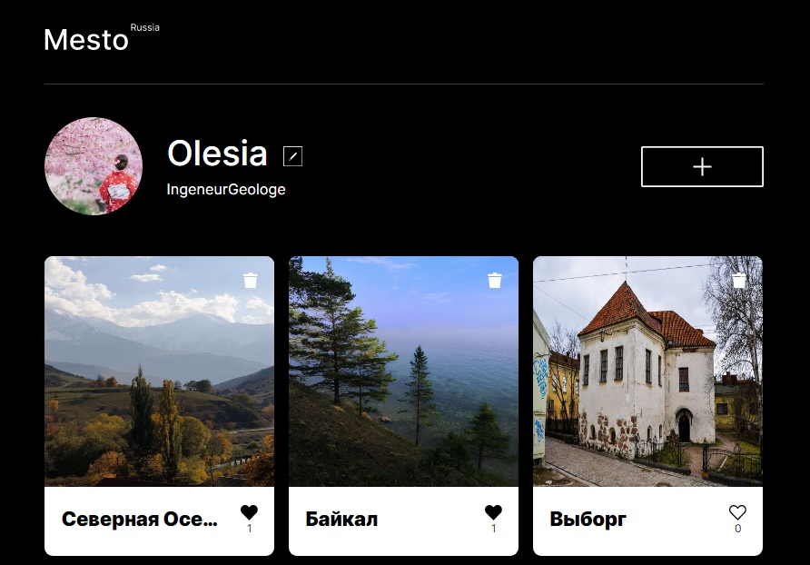

# Проект: Mesto (React)

### О проекте

[Проект](https://olesia1205.github.io/mesto-react/index.html) был создан на базе [Create React App](https://github.com/facebook/create-react-app).

`Mesto` - сайт, где можно делиться фотографиями, ставить карточкам лайки или дизлайки.
Первоначальные данные о пользователе и карточках подгружаются с сервера.
Реализована возможность редактирования профиля пользователя, смены аватара.
По клику можно посмотреть картинку в большем масштабе (zoom).
Есть возможность удалять карточки.

 `Используемые технологии:`

- [x] Функционал на Реакте (CRA)
- [x] Функциональные компоненты
- [x] Хуки
- [x] Подписка на контекст
- [x] Работа с формами
- [x] Запросы к API

 `План доработки проекта:`

- [x] Валидация форм
- [x] Добавить индикаторы загрузки запросов
- [x] Всплывающее подтверждение для удаления карточек

***

ссылка на сайт: https://olesia1205.github.io/mesto-react/index.html

