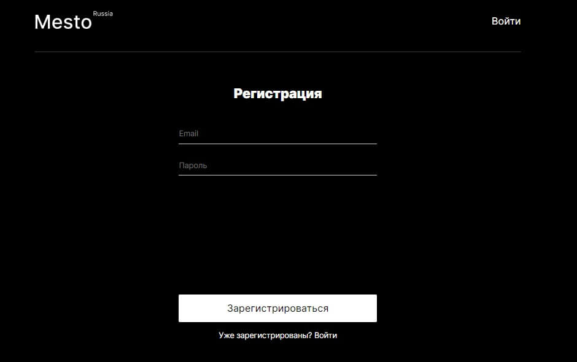
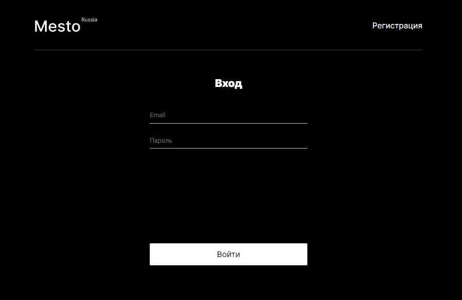
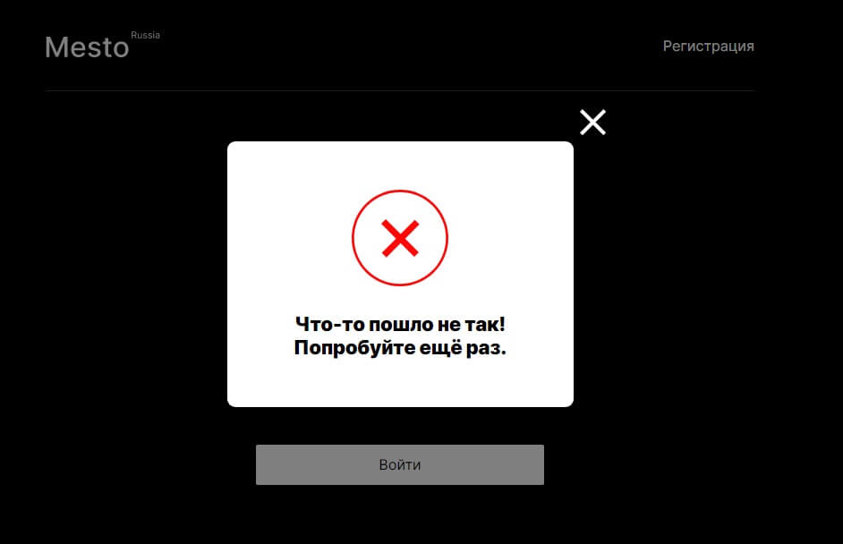
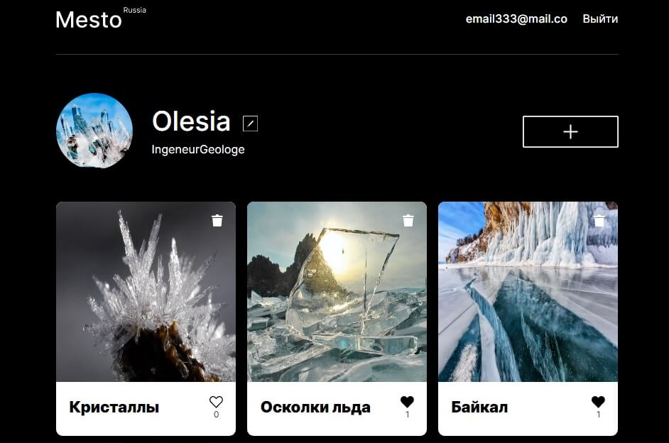

# Проект: Mesto (React)

### О проекте

[Проект](https://olesia1205.github.io/react-mesto-auth/index.html) был создан на базе [Create React App](https://github.com/facebook/create-react-app).

`Mesto` - сайт, где можно делиться фотографиями, ставить карточкам лайки или дизлайки.
Первоначальные данные о пользователе и карточках подгружаются с сервера.
Реализована возможность редактирования профиля пользователя, смены аватара.
По клику можно посмотреть картинку в большем масштабе (zoom).
Есть возможность удалять карточки.

Реализована регистрация и авторизация пользователя.     
Вся функциональность приложения доступна только авторизованным пользователям по роуту "/".       
Созданы дополнительные роуты:     
 "/sign-up" - для регистрации пользователя, и     
 "/sign-in" - для авторизации пользователя.     

 `Используемые технологии:`

- [x] Функционал на Реакте (CRA)
- [x] Функциональные компоненты
- [x] Хуки
- [x] Подписка на контекст
- [x] Работа с формами
- [x] Запросы к API
- [x] Маршрутизация приложения с помощью React Router (защищенный роут)
- [x] Работа с локальным хранилищем и токеном

 `План доработки проекта:`

- [x] Валидация форм
- [x] Добавить индикаторы загрузки запросов
- [x] Всплывающее подтверждение для удаления карточек
- [x] Добавить бургер-меню, адаптированное под мобильные устройства

***

ссылка на сайт: https://olesia1205.github.io/react-mesto-auth/index.html

